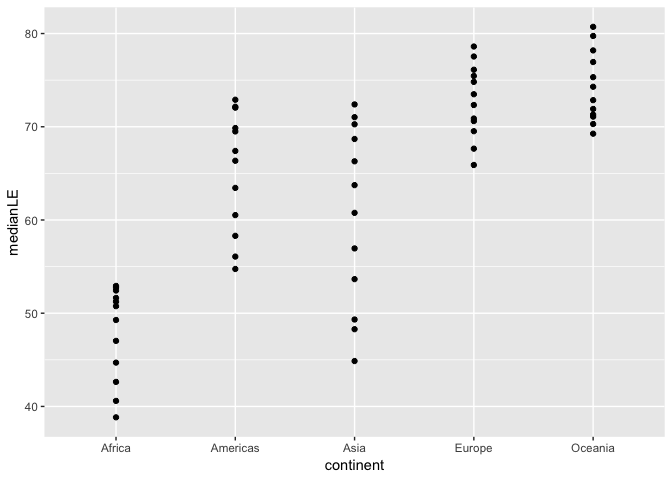

HW4
================
Malvika Mitra
8th Oct 2018

``` r
suppressPackageStartupMessages(library(tidyverse)) # to supress messages after library calls
```

    ## Warning: package 'readr' was built under R version 3.3.2

``` r
suppressPackageStartupMessages(library(ggplot2))
suppressPackageStartupMessages(library(gapminder))
```

    ## Warning: package 'gapminder' was built under R version 3.3.2

``` r
library(knitr)
library(dplyr)
```

# DATA RESHAPING:

Data Reshaping is about changing the way data is organized into rows and
columns. Most of the time data processing is done by taking the input
data as a data frame. It is easy to extract data from the rows and
columns of a data frame but there are situations when we need the data
frame in a format that is different from format in which we received it.
Functions like gather() and spread() from **tidyr** reshape the rows to
columns in a data frame.

## Activity \#2

Make a tibble with one row per year and columns for life expectancy for
two or more countries.

Use knitr::kable() to make this table look pretty in your rendered
homework.

Take advantage of this new data shape to scatterplot life expectancy for
one country against that of
another.

``` r
my_gap<-gapminder %>% #making a new dataframe and saving it                         in the variable my_gap.
  group_by(year) %>% 
  filter((country=="Canada"| country=="Algeria")) 
my_gap
```

    ## # A tibble: 24 x 6
    ## # Groups:   year [12]
    ##    country continent  year lifeExp      pop gdpPercap
    ##    <fct>   <fct>     <int>   <dbl>    <int>     <dbl>
    ##  1 Algeria Africa     1952    43.1  9279525     2449.
    ##  2 Algeria Africa     1957    45.7 10270856     3014.
    ##  3 Algeria Africa     1962    48.3 11000948     2551.
    ##  4 Algeria Africa     1967    51.4 12760499     3247.
    ##  5 Algeria Africa     1972    54.5 14760787     4183.
    ##  6 Algeria Africa     1977    58.0 17152804     4910.
    ##  7 Algeria Africa     1982    61.4 20033753     5745.
    ##  8 Algeria Africa     1987    65.8 23254956     5681.
    ##  9 Algeria Africa     1992    67.7 26298373     5023.
    ## 10 Algeria Africa     1997    69.2 29072015     4797.
    ## # ... with 14 more rows

``` r
g<-tibble(year=my_gap$year,lf=my_gap$lifeExp,country=my_gap$country)  #making a tibble
knitr::kable(g)
```

| year |     lf | country |
| ---: | -----: | :------ |
| 1952 | 43.077 | Algeria |
| 1957 | 45.685 | Algeria |
| 1962 | 48.303 | Algeria |
| 1967 | 51.407 | Algeria |
| 1972 | 54.518 | Algeria |
| 1977 | 58.014 | Algeria |
| 1982 | 61.368 | Algeria |
| 1987 | 65.799 | Algeria |
| 1992 | 67.744 | Algeria |
| 1997 | 69.152 | Algeria |
| 2002 | 70.994 | Algeria |
| 2007 | 72.301 | Algeria |
| 1952 | 68.750 | Canada  |
| 1957 | 69.960 | Canada  |
| 1962 | 71.300 | Canada  |
| 1967 | 72.130 | Canada  |
| 1972 | 72.880 | Canada  |
| 1977 | 74.210 | Canada  |
| 1982 | 75.760 | Canada  |
| 1987 | 76.860 | Canada  |
| 1992 | 77.950 | Canada  |
| 1997 | 78.610 | Canada  |
| 2002 | 79.770 | Canada  |
| 2007 | 80.653 | Canada  |

``` r
gapminder %>% 
  filter((country=="Canada"| country=="Algeria")) %>% 
ggplot(aes(year,lifeExp))+
  geom_point(aes(color=country))+
  ggtitle("      ScatterPlot of LifeExp")+
  xlab("Year")+
  ylab("LifeExp")
```

<!-- --> Output:
Filtered the Gapminder data according to requirements and saved it
my\_gap variable.

Then made a tibble out of the columns of my\_gap.

Knitted the table and finally made the scatter plot of the lifeExp of
Canada ana Algeria over the years.

The graph shows that the lifeExp of Canada is higher than that of
Algeria.

## Activity \#3

Compute some measure of life expectancy (mean? median? min? max?) for
all possible combinations of continent and year. Reshape that to have
one row per year and one variable for each continent. Or the other way
around: one row per continent and one variable per year.

Use knitr::kable() to make these tables look pretty in your rendered
homework.

Is there a plot that is easier to make with the data in this shape
versis the usual form? If so (or you think so), try it\! Reflect.

``` r
k<-gapminder %>% 
   group_by(year,continent) %>% 
  summarise(medianLE=median(lifeExp))

knitr::kable(k)
```

| year | continent | medianLE |
| ---: | :-------- | -------: |
| 1952 | Africa    |  38.8330 |
| 1952 | Americas  |  54.7450 |
| 1952 | Asia      |  44.8690 |
| 1952 | Europe    |  65.9000 |
| 1952 | Oceania   |  69.2550 |
| 1957 | Africa    |  40.5925 |
| 1957 | Americas  |  56.0740 |
| 1957 | Asia      |  48.2840 |
| 1957 | Europe    |  67.6500 |
| 1957 | Oceania   |  70.2950 |
| 1962 | Africa    |  42.6305 |
| 1962 | Americas  |  58.2990 |
| 1962 | Asia      |  49.3250 |
| 1962 | Europe    |  69.5250 |
| 1962 | Oceania   |  71.0850 |
| 1967 | Africa    |  44.6985 |
| 1967 | Americas  |  60.5230 |
| 1967 | Asia      |  53.6550 |
| 1967 | Europe    |  70.6100 |
| 1967 | Oceania   |  71.3100 |
| 1972 | Africa    |  47.0315 |
| 1972 | Americas  |  63.4410 |
| 1972 | Asia      |  56.9500 |
| 1972 | Europe    |  70.8850 |
| 1972 | Oceania   |  71.9100 |
| 1977 | Africa    |  49.2725 |
| 1977 | Americas  |  66.3530 |
| 1977 | Asia      |  60.7650 |
| 1977 | Europe    |  72.3350 |
| 1977 | Oceania   |  72.8550 |
| 1982 | Africa    |  50.7560 |
| 1982 | Americas  |  67.4050 |
| 1982 | Asia      |  63.7390 |
| 1982 | Europe    |  73.4900 |
| 1982 | Oceania   |  74.2900 |
| 1987 | Africa    |  51.6395 |
| 1987 | Americas  |  69.4980 |
| 1987 | Asia      |  66.2950 |
| 1987 | Europe    |  74.8150 |
| 1987 | Oceania   |  75.3200 |
| 1992 | Africa    |  52.4290 |
| 1992 | Americas  |  69.8620 |
| 1992 | Asia      |  68.6900 |
| 1992 | Europe    |  75.4510 |
| 1992 | Oceania   |  76.9450 |
| 1997 | Africa    |  52.7590 |
| 1997 | Americas  |  72.1460 |
| 1997 | Asia      |  70.2650 |
| 1997 | Europe    |  76.1160 |
| 1997 | Oceania   |  78.1900 |
| 2002 | Africa    |  51.2355 |
| 2002 | Americas  |  72.0470 |
| 2002 | Asia      |  71.0280 |
| 2002 | Europe    |  77.5365 |
| 2002 | Oceania   |  79.7400 |
| 2007 | Africa    |  52.9265 |
| 2007 | Americas  |  72.8990 |
| 2007 | Asia      |  72.3960 |
| 2007 | Europe    |  78.6085 |
| 2007 | Oceania   |  80.7195 |

``` r
ggplot(k,aes(continent,medianLE))+
  geom_point()
```

<!-- -->

``` r
n<-spread(k,key="continent",value="year")
n
```

    ## # A tibble: 60 x 6
    ##    medianLE Africa Americas  Asia Europe Oceania
    ##       <dbl>  <int>    <int> <int>  <int>   <int>
    ##  1     38.8   1952       NA    NA     NA      NA
    ##  2     40.6   1957       NA    NA     NA      NA
    ##  3     42.6   1962       NA    NA     NA      NA
    ##  4     44.7   1967       NA    NA     NA      NA
    ##  5     44.9     NA       NA  1952     NA      NA
    ##  6     47.0   1972       NA    NA     NA      NA
    ##  7     48.3     NA       NA  1957     NA      NA
    ##  8     49.3   1977       NA    NA     NA      NA
    ##  9     49.3     NA       NA  1962     NA      NA
    ## 10     50.8   1982       NA    NA     NA      NA
    ## # ... with 50 more rows

``` r
ggplot(n,aes(Africa,medianLE))+
  geom_point()
```

    ## Warning: Removed 48 rows containing missing values (geom_point).

<!-- -->

``` r
ggplot(n,aes(Asia,medianLE))+
  geom_point()
```

    ## Warning: Removed 48 rows containing missing values (geom_point).

<!-- --> Output:

Grouped by continent and year.

Used the summarise() fn to calculate the median lifeExp.

Used spread() fn to spread the data continent wise according to the
year.

I dont think its easier because we will have to make separate plots for
each continent versus earlier we had one plot with all the continents
and their respective medianLF plotted on it.

## Activity \#4

In Window functions, we formed a tibble with 24 rows: 2 per year, giving
the country with both the lowest and highest life expectancy (in Asia).
Take that table (or a similar one for all continents) and reshape it so
you have one row per year or per year \* continent combination.

``` r
a<-my_gap %>%
  filter(continent == "Asia") %>%
  select(year, country, lifeExp) %>%
  group_by(year) %>%
  filter(min_rank(desc(lifeExp)) < 2 | min_rank(lifeExp) < 2) %>% 
  arrange(year) %>%
  print(n = Inf)
```

    ## # A tibble: 0 x 3
    ## # Groups:   year [0]
    ## # ... with 3 variables: year <int>, country <fct>, lifeExp <dbl>

``` r
my_gap
```

    ## # A tibble: 24 x 6
    ## # Groups:   year [12]
    ##    country continent  year lifeExp      pop gdpPercap
    ##    <fct>   <fct>     <int>   <dbl>    <int>     <dbl>
    ##  1 Algeria Africa     1952    43.1  9279525     2449.
    ##  2 Algeria Africa     1957    45.7 10270856     3014.
    ##  3 Algeria Africa     1962    48.3 11000948     2551.
    ##  4 Algeria Africa     1967    51.4 12760499     3247.
    ##  5 Algeria Africa     1972    54.5 14760787     4183.
    ##  6 Algeria Africa     1977    58.0 17152804     4910.
    ##  7 Algeria Africa     1982    61.4 20033753     5745.
    ##  8 Algeria Africa     1987    65.8 23254956     5681.
    ##  9 Algeria Africa     1992    67.7 26298373     5023.
    ## 10 Algeria Africa     1997    69.2 29072015     4797.
    ## # ... with 14 more rows

``` r
spread(a,country,year)
```

    ## # A tibble: 0 x 1
    ## # ... with 1 variable: lifeExp <dbl>
    
 Output:
 
 Reshaped the data.

## Activity \#5

Previous TA Andrew MacDonald has a nice data manipulation sampler. Make
up a similar set of exercises for yourself, in the abstract or (even
better) using Gapminder or other data, and solve them.

Creating my dataframe

``` r
A <- data.frame(
       x1 = c('A', 'A','A', 'B', 'B'),
       x2 = c('a', 'b', 'b', 'c', 'd'),
       x3 = c(1, 1, 1, 2, 2))
A
```

    ##   x1 x2 x3
    ## 1  A  a  1
    ## 2  A  b  1
    ## 3  A  b  1
    ## 4  B  c  2
    ## 5  B  d  2

GROUP

``` r
B<-A %>% 
  group_by(x1,x2) %>% 
  summarize(Nrows=n(),
            mean=mean(x3))
B
```

    ## # A tibble: 4 x 4
    ## # Groups:   x1 [?]
    ##   x1    x2    Nrows  mean
    ##   <fct> <fct> <int> <dbl>
    ## 1 A     a         1     1
    ## 2 A     b         2     1
    ## 3 B     c         1     2
    ## 4 B     d         1     2

Output:

Created a dataframe B and grouped by columns x1 and x2. the Nrows
coulmns shows the count of the rows under the corresponding values of x1
and x2.Example A of x1 has a corresponding value of a in just one row of
x2 so Nrows value is 1 for this entrie and mean column just calulates
the mean of x3 values corresponding to x1 values.

SUBSET

subset Table A to give C:

``` r
C<-filter(A,x1=="A")
C
```

    ##   x1 x2 x3
    ## 1  A  a  1
    ## 2  A  b  1
    ## 3  A  b  1

TRANSPOSE

transpose C to give:

``` r
C_transpose <- data.frame(t(C))
C_transpose
```

    ##    X1 X2 X3
    ## x1  A  A  A
    ## x2  a  b  b
    ## x3  1  1  1

SORT

``` r
A_arranged <- arrange(A,x1,x2,x3)
A_arranged
```

    ##   x1 x2 x3
    ## 1  A  a  1
    ## 2  A  b  1
    ## 3  A  b  1
    ## 4  B  c  2
    ## 5  B  d  2

# Join Prompts

Join Prompts are used to combine datasets in R, using various functions
like left\_join,right\_join,inner\_join,full\_join etc.

## Activity \#1

Create a second data frame, complementary to Gapminder. Join this with
(part of) Gapminder using a dplyr join function and make some
observations about the process and result. Explore the different types
of joins. Examples of a second data frame you could build: One row per
country, a country variable and one or more variables with extra info,
such as language spoken, NATO membership, national animal, or capitol
city. One row per continent, a continent variable and one or more
variables with extra info, such as northern versus southern hemisphere.

``` r
gap<-gapminder[1:5,] %>% 
  select(country,year,lifeExp)
gap
```

    ## # A tibble: 5 x 3
    ##   country      year lifeExp
    ##   <fct>       <int>   <dbl>
    ## 1 Afghanistan  1952    28.8
    ## 2 Afghanistan  1957    30.3
    ## 3 Afghanistan  1962    32.0
    ## 4 Afghanistan  1967    34.0
    ## 5 Afghanistan  1972    36.1

``` r
cont<-data.frame(
  year=c(1952,1957,1962,1967,1972),
  gdp=c(779.4453,820.8530,853.1007,836.1971,739.9811)
)
cont
```

    ##   year      gdp
    ## 1 1952 779.4453
    ## 2 1957 820.8530
    ## 3 1962 853.1007
    ## 4 1967 836.1971
    ## 5 1972 739.9811

``` r
left_join(gap,cont)
```

    ## Joining, by = "year"

    ## # A tibble: 5 x 4
    ##   country      year lifeExp   gdp
    ##   <fct>       <dbl>   <dbl> <dbl>
    ## 1 Afghanistan  1952    28.8  779.
    ## 2 Afghanistan  1957    30.3  821.
    ## 3 Afghanistan  1962    32.0  853.
    ## 4 Afghanistan  1967    34.0  836.
    ## 5 Afghanistan  1972    36.1  740.

``` r
inner_join(gap,cont)
```

    ## Joining, by = "year"

    ## # A tibble: 5 x 4
    ##   country      year lifeExp   gdp
    ##   <fct>       <dbl>   <dbl> <dbl>
    ## 1 Afghanistan  1952    28.8  779.
    ## 2 Afghanistan  1957    30.3  821.
    ## 3 Afghanistan  1962    32.0  853.
    ## 4 Afghanistan  1967    34.0  836.
    ## 5 Afghanistan  1972    36.1  740.

``` r
semi_join(gap,cont)
```

    ## Joining, by = "year"

    ## # A tibble: 5 x 3
    ##   country      year lifeExp
    ##   <fct>       <int>   <dbl>
    ## 1 Afghanistan  1952    28.8
    ## 2 Afghanistan  1957    30.3
    ## 3 Afghanistan  1962    32.0
    ## 4 Afghanistan  1967    34.0
    ## 5 Afghanistan  1972    36.1

``` r
full_join(gap,cont)
```

    ## Joining, by = "year"

    ## # A tibble: 5 x 4
    ##   country      year lifeExp   gdp
    ##   <fct>       <dbl>   <dbl> <dbl>
    ## 1 Afghanistan  1952    28.8  779.
    ## 2 Afghanistan  1957    30.3  821.
    ## 3 Afghanistan  1962    32.0  853.
    ## 4 Afghanistan  1967    34.0  836.
    ## 5 Afghanistan  1972    36.1  740.

Output:

left\_join: Returns all rows of gap, and all columns of gap and cont.

inner\_join:Return all rows of gap where there are matching values in
cont, and all columns of gap and cont.

semi\_join: Returns all rows of gap where there are matching values in
cont, keeping just columns from gap. A semi join differs from an inner
join because an inner join will return one row of gap for each matching
row of cont, where as a semi join will never duplicate rows of gap.

full\_join: Returns all rows and all columns from both gap and cont.

## Activity \#2

Create your own cheatsheet patterned after Jenny’s but focused on
something you care about more than comics\! Inspirational examples:

Pets I have owned + breed + friendly vs. unfriendly + ??. Join to a
table of pet breed, including variables for furry vs not furry, mammal
true or false, etc. Movies and studios…. Athletes and teams….

You will likely need to iterate between your data prep and your joining
to make your explorations comprehensive and interesting. For example,
you will want a specific amount (or lack) of overlap between the two
data.frames, in order to demonstrate all the different joins. You will
want both the data frames to be as small as possible, while still
retaining the expository value.

``` r
pet<- data.frame(
  name=c("tim","lily","jin"),
  type=c("dog","parrot","cat"),
  nature=c("friendly","friendly","nonfriendly")
)
  animal<-data.frame(
    type=c("dog","bird","cat"),
    life=c(10,2,9)
    )
  
pet 
```

    ##   name   type      nature
    ## 1  tim    dog    friendly
    ## 2 lily parrot    friendly
    ## 3  jin    cat nonfriendly

``` r
animal
```

    ##   type life
    ## 1  dog   10
    ## 2 bird    2
    ## 3  cat    9

Ctreated two dataframes pet and animal and will now explore various
joins on
    them.

left\_join(pet,animal):

``` r
left_join(pet,animal,by="type")
```

    ## Warning: Column `type` joining factors with different levels, coercing to
    ## character vector

    ##   name   type      nature life
    ## 1  tim    dog    friendly   10
    ## 2 lily parrot    friendly   NA
    ## 3  jin    cat nonfriendly    9

Output:

Join matching rows from `animal` to `pet` by matching “type” variable.

The type column of pet is printed and since parrot does mot have a
matching value in animal dataframe a NA is printed in the life
    column.

right\_join(pet,animal):

``` r
right_join(pet,animal,by="type")
```

    ## Warning: Column `type` joining factors with different levels, coercing to
    ## character vector

    ##   name type      nature life
    ## 1  tim  dog    friendly   10
    ## 2 <NA> bird        <NA>    2
    ## 3  jin  cat nonfriendly    9

Output:

Join matching rows from `animal` to `pet` by matching “type” variable.

The type column of animal is printed and since bird does mot have a
matching value in animal dataframe a NA is printed in both name and
nature
    columns.

inner\_join(pet,animal):

``` r
inner_join(pet,animal)
```

    ## Joining, by = "type"

    ## Warning: Column `type` joining factors with different levels, coercing to
    ## character vector

    ##   name type      nature life
    ## 1  tim  dog    friendly   10
    ## 2  jin  cat nonfriendly    9

Output:

Returns all rows from pet where there are matching values in animal, and
all columns from pet and animal.

We lose parrot in the join because, although he appears in pet, but does
not appear in animal. The join result has all variables from pet plus
life, from
    animal.

semi\_join(pet,animal):

``` r
semi_join(pet,animal) 
```

    ## Joining, by = "type"

    ## Warning: Column `type` joining factors with different levels, coercing to
    ## character vector

    ##   name type      nature
    ## 1  tim  dog    friendly
    ## 2  jin  cat nonfriendly

Output:

Returns all rows from pet where there are matching values in animal,
keeping just columns from pet. A semi join differs from an inner join
because an inner join will return one row of pet for each matching row
of animal, whereas a semi join will never duplicate rows of pet. This is
a filtering
    join.

anti\_join(pet,animal):

``` r
anti_join(pet,animal)
```

    ## Joining, by = "type"

    ## Warning: Column `type` joining factors with different levels, coercing to
    ## character vector

    ##   name   type   nature
    ## 1 lily parrot friendly

Output:

Return all rows from pet where there are not matching values in animal,
keeping just columns from pet. This is a filtering
    join.

left\_join(animal,pet):

``` r
left_join(animal,pet)
```

    ## Joining, by = "type"

    ## Warning: Column `type` joining factors with different levels, coercing to
    ## character vector

    ##   type life name      nature
    ## 1  dog   10  tim    friendly
    ## 2 bird    2 <NA>        <NA>
    ## 3  cat    9  jin nonfriendly

Output:

Join matching rows from `pet` to `animal` by matching “type” variable.

The type column of animal is printed and since bird does mot have a
matching value in pet dataframe a NA is printed in the name and nature
columns.

right\_join(animal,pet):

``` r
right_join(animal,pet)
```

    ## Joining, by = "type"

    ## Warning: Column `type` joining factors with different levels, coercing to
    ## character vector

    ##     type life name      nature
    ## 1    dog   10  tim    friendly
    ## 2 parrot   NA lily    friendly
    ## 3    cat    9  jin nonfriendly

Output:

Join matching rows from `pet` to `animal` by matching “type” variable.

The type column of pet is printed and since parrot does mot have a
matching value in animal dataframe a NA is printed in the life
    column.

inner\_join(animal,pet):

``` r
inner_join(animal,pet)
```

    ## Joining, by = "type"

    ## Warning: Column `type` joining factors with different levels, coercing to
    ## character vector

    ##   type life name      nature
    ## 1  dog   10  tim    friendly
    ## 2  cat    9  jin nonfriendly

Output: Returns all rows from animal where there are matching values in
pet, and all columns from pet and animal.

We lose bird in the join because, although he appears in animal, but
does not appear in pet. The join result has life from animal plus name,
nature from
    pet.

semi\_join(animal,pet):

``` r
semi_join(animal,pet)
```

    ## Joining, by = "type"

    ## Warning: Column `type` joining factors with different levels, coercing to
    ## character vector

    ##   type life
    ## 1  dog   10
    ## 2  cat    9

Output:

Returns all rows from animal where there are matching values in pet,
keeping just columns from animal. A semi join differs from an inner join
because an inner join will return one row of animal for each matching
row of pet, whereas a semi join will never duplicate rows of animal.
This is a filtering
    join.

anti\_join(animal,pet):

``` r
anti_join(animal,pet)
```

    ## Joining, by = "type"

    ## Warning: Column `type` joining factors with different levels, coercing to
    ## character vector

    ##   type life
    ## 1 bird    2

Output:

Return all rows from animal that have no matching values in pet, keeping
just columns from animal. This is a filtering
    join.

full\_join(pet,animal):

``` r
full_join(pet,animal)
```

    ## Joining, by = "type"

    ## Warning: Column `type` joining factors with different levels, coercing to
    ## character vector

    ##   name   type      nature life
    ## 1  tim    dog    friendly   10
    ## 2 lily parrot    friendly   NA
    ## 3  jin    cat nonfriendly    9
    ## 4 <NA>   bird        <NA>    2

Output: Return all rows and all columns from both pet and animal. Where
there are not matching values, returns NA for the one missing. This is a
mutating join.

We get all variables from pet AND all variables from animal. Any row
that derives solely from one table or the other carries NAs in the
variables found only in the other table.

``` r
animal2<-data.frame(
    type=c("tiger","bird","lion"),
    life=c(10,5,9)
    )
```

left\_joint(pet,animal2):

``` r
left_join(pet,animal2)
```

    ## Joining, by = "type"

    ## Warning: Column `type` joining factors with different levels, coercing to
    ## character vector

    ##   name   type      nature life
    ## 1  tim    dog    friendly   NA
    ## 2 lily parrot    friendly   NA
    ## 3  jin    cat nonfriendly   NA

Output:

Joins matching rows from animal2 to pet.

Since the type column values dont match and the life times of a dog,
parrot and cat are not defined in the type column of animal2 thats why
after joining the two datasets the joined life column gives
    NAs.

inner\_join(pet,animal2):

``` r
inner_join(pet,animal2)
```

    ## Joining, by = "type"

    ## Warning: Column `type` joining factors with different levels, coercing to
    ## character vector

    ## [1] name   type   nature life  
    ## <0 rows> (or 0-length row.names)

Output:

Joins data. Retains only rows common in both sets. Since there are no
common rows so it returns 0 rows in the
    result.

anti\_join():

``` r
anti_join(pet,animal2)
```

    ## Joining, by = "type"

    ## Warning: Column `type` joining factors with different levels, coercing to
    ## character vector

    ##   name   type      nature
    ## 1  tim    dog    friendly
    ## 2 lily parrot    friendly
    ## 3  jin    cat nonfriendly

Output:

Returns all rows in pet that do not have a match in
    animal.

full\_join(pet,animal2):

``` r
full_join(pet,animal2)
```

    ## Joining, by = "type"

    ## Warning: Column `type` joining factors with different levels, coercing to
    ## character vector

    ##   name   type      nature life
    ## 1  tim    dog    friendly   NA
    ## 2 lily parrot    friendly   NA
    ## 3  jin    cat nonfriendly   NA
    ## 4 <NA>  tiger        <NA>   10
    ## 5 <NA>   bird        <NA>    5
    ## 6 <NA>   lion        <NA>    9

Output:

Joins the data from both the dataframes.Retains all values,all rows from
both.
